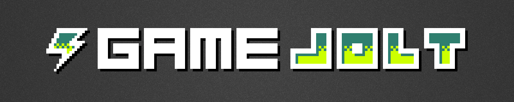

# `GameJoltDotNet`
GameJoltDotNet is a GameJolt [Game API](https://gamejolt.com/game-api/doc) client for the `.NET` Framework 
and can therefore be used by every `.NET` language, like `C#`, `VB.NET` or `F#`.

For best portability this library is based on .NET Standard 1.3 and can therefore be used on a wide variety of different platforms. 
The following platforms are supported:

Framework | Version
----- | -----
.NET Standard | 1.3
.NET Core | 1.0
.NET Framework | 4.6
Mono | 4.6
Xamarin.iOS | 10.0
Xamarin.Mac | 3.0
Xamarin.Android | 7.0
Universal Windows Platform | 10.0


## GameJolt API Overview
Service | Description
----- | -----
Datastore | Manipulate items in a cloud-based data storage.
Time | Get the server's time.
Scores | Manipulate scores on score tables.
Sessions | Set up sessions for your game.
Trophies | Manage trophies for your game.
Users | Access user-based features.
Friends | List a user's friends.

This library is heavily based on the async/await mechanism of C# and can therefore be used without blocking the main thread. 
Furthermore it provides a convenience facade API, which internally uses the async/await API, but provides a simple, callback based API as a front end.

## Example
First of all you have to create a new api instance:
```cs
var api = new GameJoltApi(gameId, privateKey);
```
Afterwards you can directly use the different GameJolt features. 
```cs
// by using async/await:
var response = await api.Scores.FetchAsync();
if(response.Success) {
    // response.Data contains the list of scores
}

// or by using the callback mechanism:
api.Scores.Fetch(callback: response => {
    if(response.Success) {
        // response.Data contains the list of scores
    }
});
```

Some APIs require an authenticated user, because they set or get data for a certain user. The authentication can be done like so:
```cs
var auth = await api.Users.AuthAsync(userName, userToken);
if(auth.Success) {
    api.Trophies.SetAchieved(auth.Data, trophyId);
}
``` 
